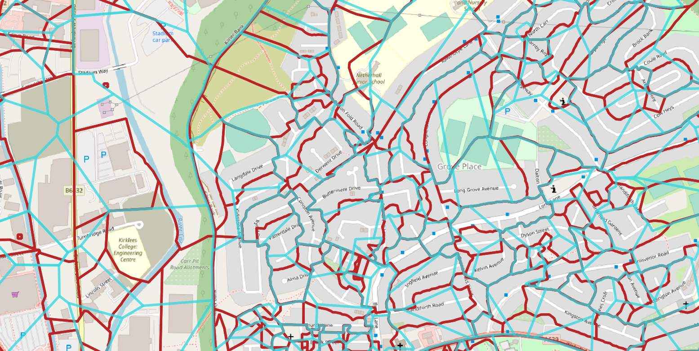

# Open Postcodes
Open Postcode Polygons

Open Postcode Polygons is an attempt to make a Open Data version of the UK postcode system.

## Why is this needed

Although Postcode points are [published](https://www.ordnancesurvey.co.uk/business-government/products/code-point-open) as open data, the polygons showing the exact boundaries of each Postcode area are not.  THis is a little bonkers considering how important they are to our address system, and that they are hardly a secret.

This repo attemts to cirumvent this problem using some simple steps

1. Use the Open Postcode points to get the approximate location of the postcode area
2. Use the fact that the original Output Areas for the 2001 Census were partially based on postcode areas.
3. Within each Output Area construct voroni polygons to approximate postcode areas.

**Example: Open Postcodes (blue), real postcode areas (red)**
 

# Legal Stuff

## OA Boundaries

Contains National Statistics data © Crown copyright and database right [year]
Contains OS data © Crown copyright [and database right] (year)
    
Office for National Statistics (2001). 2001 Census: boundary data (England and Wales) [data collection].
UK Data Service. SN:5819 UKBORDERS: Digitised Boundary Data, 1840- and Postcode Directories, 1980-.
http://discover.ukdataservice.ac.uk/catalogue/?sn=5819&type=Data%20catalogue,
Retrieved from http://census.ukdataservice.ac.uk/get-data/boundary-data.aspx.

## Postcode Points

ORDNANCE SURVEY DATA LICENCE

Your use of data is subject to terms at www.ordnancesurvey.co.uk/opendata/licence.

Contains Ordnance Survey data © Crown copyright and database right 2020.

Contains Royal Mail data © Royal Mail copyright and database right 2020.
Contains National Statistics data © Crown copyright and database right 2020.

February 2020
Contains public sector information licensed under the Open Government Licence v3.